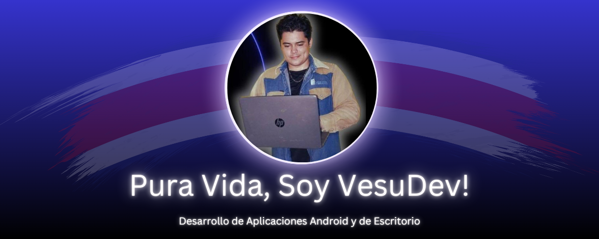

#### 🔍 Entender, ⚙️ Resolver y 💻 Codificar!

## Sobre Mí

¡Hola! Soy **Jeffry Pérez Duarte**, mejor conocido como *VesuDev* en el mundo del desarrollo de software. Mi pasión por la tecnología y la resolución de problemas me ha llevado a especializarme en el desarrollo de aplicaciones móviles y de escritorio. Cada proyecto que creo es una oportunidad para transformar ideas en herramientas prácticas que faciliten la vida de las personas.

Mi enfoque principal es desarrollar aplicaciones para pequeñas empresas que tienen problemas que resolver y no mucho presupuesto. Quiero ayudar a las personas y aportar valor al mundo con mis proyectos.

## Mis Objetivos 🎯

Estoy en constante búsqueda de mejorar mis habilidades y aprender nuevas tecnologías. Mi objetivo a largo plazo es contribuir a proyectos que tengan un impacto real en la sociedad, ya sea a través de software que mejore la eficiencia en industrias tradicionales o de aplicaciones que faciliten la vida cotidiana.

## Contacta Conmigo

Si te interesa lo que hago o si tienes alguna propuesta de colaboración, no dudes en ponerte en contacto conmigo. Estoy siempre abierto a nuevas ideas y a trabajar en proyectos Colaborativos.

- **Email:** [Vesudev18@gmail.com](mailto:Vesudev18@gmail.com)
